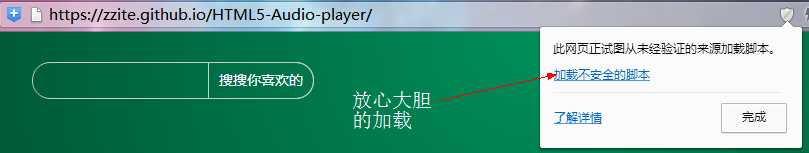
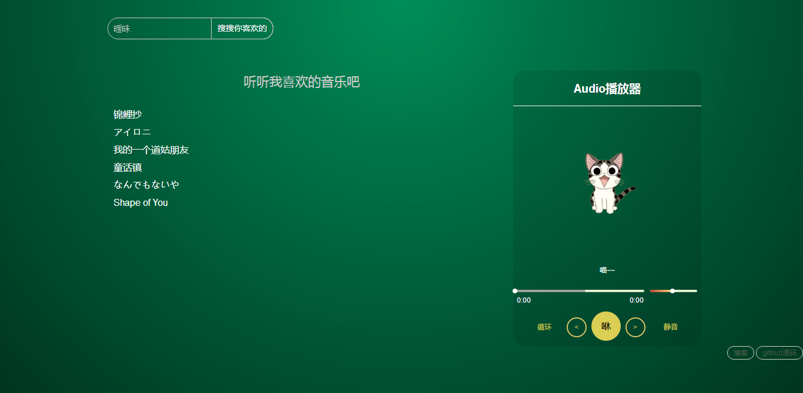
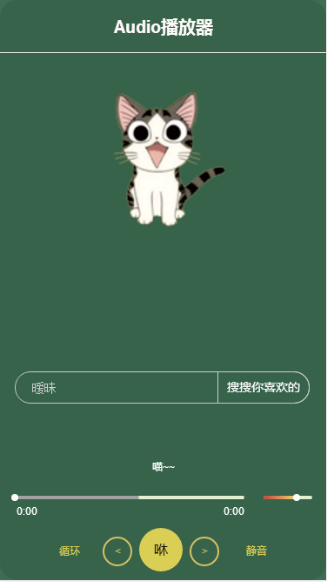

# HTML5-Audio-player
A music player that uses HTML5 and native javascript to complete.

## 简介

* 使用HTML5中的 Audio 和原生 Javascript 以及 CSS3 制作的音乐播放器Demo
* 主要功能有播放，上下曲切换，静音循环，音量、歌曲进度调节，列表内的歌曲点击直接播放以及在线音乐搜索播放
* 音乐搜索功能主要使用 jsonp 做了个简单的跨域，获取网易云音乐mp3的歌曲信息，可能有的歌曲无法播放（资源问题）另外因为<strong>Jsonp外部加载的源为http协议，在https网站（比如现在这个demo地址）上调用会被浏览器拦截，无法搜索播放请手动解除浏览器的拦截</strong>

* 响应式设计，兼容移动端（搜索功能这下是彻底挂了^ ^）
* 因为是拿来写原生js练手的Demo，只是做大程度的去完成预定的功能，布局参考了别的播放器
* 本地保存了6首我喜欢的歌曲，听听看吧

## 预览

<a href="https://zzite.github.io/HTML5-Audio-player/" target="_blank">点击查看在线DEMO</a>

### 手机扫描二维码快速查看

***

## 更新

7.4

原先使用的网易云api已经挂掉。本地歌曲改用了野生api，加载速度略慢~搜索功能暂时无法访问资源。

***

